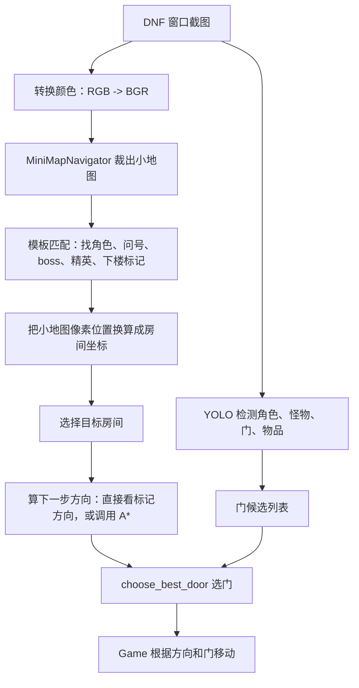

# DNF 刷图程序：小地图截图、A* 寻路和移动逻辑新手讲解

这份文档讲的是当前 `dnf` 目录里的刷图程序如何把“游戏截图”变成“下一步往哪走”。

先记住一句话：

> A* 算法本身不认识图片。  
> 它只认识类似 `(第几行, 第几列)` 这样的房间坐标。  
> 真正负责看截图、裁小地图、识别角色和目标房间的是 `MiniMapNavigator`。

## 1. 相关文件

| 文件 | 作用 |
| --- | --- |
| `dnf/main.py` | 主循环入口：找 DNF 窗口、截图、调用 YOLO、调用小地图导航、调用移动逻辑 |
| `dnf/minimap_nav.py` | 小地图导航核心：裁小地图、模板匹配、计算当前房间和目标房间、调用 A* |
| `dnf/minimap_astar.py` | A* 寻路算法：输入网格起点和终点，输出下一步方向 |
| `dnf/map_specs.py` | 地图配置：小地图截图区域、房间行列数、哪些格子能走 |
| `dnf/door_strategy.py` | 根据小地图方向和 YOLO 识别到的门，挑一个最合适的门 |
| `dnf/game.py` | 游戏动作逻辑：打怪、捡物、找门、按方向键移动 |
| `dnf/minimap_route_demo.py` | 小地图导航调试演示脚本 |

## 2. 整体流程

程序每一帧大概做这些事：



对应到代码：

1. `dnf/main.py:108` 用 `pyautogui.screenshot(...)` 截游戏窗口。
2. `dnf/main.py:136` 调用 `detector.detect(img_np)`，让 YOLO 识别角色、怪、门、物品等。
3. `dnf/main.py:139` 把截图从 RGB 转成 OpenCV 常用的 BGR。
4. `dnf/main.py:140` 调用 `navigator.build_route_snapshot(frame_bgr, obj or [])`。
5. `dnf/main.py:161` 到 `dnf/main.py:168` 把小地图算出的方向和门位置传给 `Game`，再执行移动。

## 3. 截图是怎么传给小地图导航的

主循环里截图函数是：

```python
img = pyautogui.screenshot(region=(left, top, width, height))
img_np = np.array(img)
```

这里得到的是整张游戏客户端截图，不是小地图截图。

然后主循环做两件事：

```python
img, obj = detector.detect(img_np)
frame_bgr = cv2.cvtColor(img_np, cv2.COLOR_RGB2BGR)
route_snapshot = navigator.build_route_snapshot(frame_bgr, obj or [])
```

注意这里有两个输入：

| 输入 | 给谁用 | 用途 |
| --- | --- | --- |
| `img_np` | YOLO 检测器 | 找角色、怪物、门、物品 |
| `frame_bgr` | `MiniMapNavigator` | 裁小地图、识别房间标记、算路线 |

所以“小地图路线”和“YOLO 检测”是并行合作的：

- 小地图告诉程序“下一步应该往右/往下/往上”。
- YOLO 告诉程序“屏幕上的门、怪物、角色在哪里”。
- `Game` 把这两边的信息合起来，决定按哪个方向键。

## 4. 小地图是怎么从整张截图里裁出来的

小地图区域配置在 `dnf/map_specs.py`。

比如 `generic` 地图：

```python
"generic": MapSpec(
    name="generic",
    crop_rect_1067=(893, 52, 1055, 142),
    crop_rect_800=(680, 57, 780, 155),
    minimap_width=162,
    minimap_height=90,
    rows=5,
    cols=9,
    room_grid=_all_walkable(5, 9),
    room_rect_800=(686, 82, 776, 151),
),
```

几个字段的意思：

| 字段 | 小白理解 |
| --- | --- |
| `crop_rect_1067` | 如果游戏截图宽度按 1067 参考，小地图在整张图里的矩形区域 |
| `crop_rect_800` | 如果游戏截图宽度接近 800，小地图在整张图里的矩形区域 |
| `rows` | 小地图房间有几行 |
| `cols` | 小地图房间有几列 |
| `room_grid` | 哪些房间能走，`0` 表示能走，`1` 表示不能走 |
| `room_rect_800` / `room_rect_1067` | 小地图里面真正用于分房间格子的区域 |

裁图逻辑在 `dnf/minimap_nav.py:237`：

```python
crop_rect, room_rect = self._scaled_crop_and_room_rect(frame)
x1, y1, x2, y2 = _clamp_rect(crop_rect, frame_w, frame_h)
minimap = frame[y1:y2, x1:x2]
```

这段代码做了三件事：

1. 根据当前截图分辨率，把配置里的小地图矩形缩放到真实尺寸。
2. 用 `frame[y1:y2, x1:x2]` 从整张截图里切出小地图。
3. 记录 `_last_room_rect`，后面要靠它把像素坐标换算成房间行列。

## 5. 小地图截图里怎么识别角色和目标房间

程序不是用 A* 去识别图片，而是用 OpenCV 模板匹配。

模板图片在 `dnf/res/` 里，例如：

- `map_hero.png`：角色当前位置标记
- `map_query.png` / `map_query1.png` / 其他 query 模板：问号房间
- `map_query2.png`：boss 标记
- `map_elite.png`：精英标记
- `map_down.png`：下楼标记

核心匹配函数在 `dnf/minimap_nav.py:254`：

```python
result = cv2.matchTemplate(match_image, scaled_template, cv2.TM_CCOEFF_NORMED)
ys, xs = np.where(result >= threshold)
```

它的意思可以理解成：

1. 拿一张小模板，比如角色图标。
2. 在小地图截图里到处滑动比较。
3. 每个位置给一个相似度分数。
4. 分数超过阈值，就认为这里找到了这个标记。

识别流程在 `detect_room_markers()`，也就是 `dnf/minimap_nav.py:439`：

```python
minimap = self.extract_minimap(frame)
hero_matches = self._match_marker(minimap, ["hero"], "hero")
boss_matches = self._match_template(minimap, self.templates["boss"], ...)
query_matches = self._match_marker(minimap, query_names, "query")
```

识别到标记后，程序拿到的是“小地图里的像素坐标”，比如：

```text
角色标记中心：x=42, y=31
问号标记中心：x=86, y=66
```

但 A* 不能直接用像素坐标，它要的是房间格子坐标。所以还要进入下一步。

## 6. 像素坐标怎么变成房间坐标

转换函数是 `compute_room_id()`，在 `dnf/minimap_nav.py:392`。

核心逻辑是：

```python
cell_w = room_w / self.spec.cols
cell_h = room_h / self.spec.rows
row = int(local_y // cell_h)
col = int(local_x // cell_w)
return row, col
```

小白可以这样理解：

1. 小地图房间区域有一个总宽度 `room_w` 和总高度 `room_h`。
2. 地图配置里写了 `rows` 和 `cols`。
3. 用 `room_w / cols` 算出每一列有多宽。
4. 用 `room_h / rows` 算出每一行有多高。
5. 标记的像素坐标落在哪一格，就得到 `(row, col)`。

坐标方向是这样的：

```text
(0, 0)  (0, 1)  (0, 2)
(1, 0)  (1, 1)  (1, 2)
(2, 0)  (2, 1)  (2, 2)
```

- `row` 越大，越靠下。
- `col` 越大，越靠右。

所以：

- 从 `(1, 1)` 到 `(1, 2)` 是 `right`
- 从 `(1, 1)` 到 `(2, 1)` 是 `down`
- 从 `(1, 1)` 到 `(0, 1)` 是 `up`
- 从 `(1, 1)` 到 `(1, 0)` 是 `left`

## 7. 目标房间是怎么选的

目标选择在 `dnf/minimap_nav.py:548` 的 `_pick_target()`。

当前代码的优先级比较简单：

```python
if prefer_special_room:
    candidates.extend([
        ("query", query_room),
        ("boss", boss_room),
    ])
else:
    candidates.append(("boss", boss_room))
```

也就是说：

1. 默认先找问号房间 `query_room`。
2. 如果没有问号房间，再找 boss 房间 `boss_room`。
3. `elite_room` 和 `down_room` 当前会被识别、会打日志、也会用于排除误判，但没有作为主要路线目标。

最后得到：

```text
current_room = 当前角色在哪个房间
target_room = 要去哪个房间
target_kind = 目标类型，比如 query 或 boss
```

## 8. A* 是怎么接上的

真正连接点在 `dnf/minimap_nav.py:601` 的 `build_route_snapshot()`。

关键代码在 `dnf/minimap_nav.py:624` 到 `dnf/minimap_nav.py:631`：

```python
if current_room is not None and target_room is not None:
    target_marker = room_info.get(f"{target_kind}_marker") if target_kind else None
    if current_marker is not None and target_marker is not None:
        next_room_direction = self._marker_direction(current_marker, target_marker)
    if next_room_direction is None:
        route_priority = self._route_priority(current_room, target_room)
        next_room_direction = next_direction(
            deepcopy(self.spec.room_grid),
            current_room,
            target_room,
            priority=route_priority,
        )
```

这里有一个很重要的细节：程序有两种算方向的方式。

### 方式一：直接看两个标记的像素方向

如果当前角色标记和目标标记都识别到了，程序先用 `_marker_direction()`。

它在 `dnf/minimap_nav.py:583`：

```python
dx = target_marker[0] - current_marker[0]
dy = target_marker[1] - current_marker[1]
```

小白理解：

- 目标的 x 比角色大很多，就是在右边。
- 目标的 x 比角色小很多，就是在左边。
- 目标的 y 比角色大很多，就是在下面。
- 目标的 y 比角色小很多，就是在上面。

这种方式可以直接返回：

```text
right
left
up
down
right_down
right_up
left_down
left_up
```

### 方式二：如果不能直接判断，就调用 A*

如果 `_marker_direction()` 没算出方向，就调用：

```python
next_direction(self.spec.room_grid, current_room, target_room, priority=route_priority)
```

这里传给 A* 的三个核心东西是：

| 参数 | 含义 |
| --- | --- |
| `self.spec.room_grid` | 房间地图网格，`0` 能走，`1` 不能走 |
| `current_room` | 当前房间坐标，例如 `(1, 2)` |
| `target_room` | 目标房间坐标，例如 `(3, 5)` |

所以 A* 的输入不是图片，而是这种形式：

```python
grid = [
    [0, 0, 0, 0],
    [0, 1, 1, 0],
    [0, 0, 0, 0],
]
start = (0, 0)
end = (2, 3)
```

## 9. A* 算法在这个程序里怎么工作

A* 代码在 `dnf/minimap_astar.py`。

它的目标是：从起点房间走到终点房间，并尽量走最短路线。

### 9.1 估算距离

`heuristic()` 在 `dnf/minimap_astar.py:21`：

```python
return abs(a[0] - b[0]) + abs(a[1] - b[1])
```

这叫曼哈顿距离。比如从 `(1, 1)` 到 `(3, 4)`：

```text
上下差 2 格，左右差 3 格，总共估计 5 格
```

### 9.2 找相邻房间

`_neighbors()` 在 `dnf/minimap_astar.py:25`。

它只会考虑上下左右四个方向，不考虑斜着走：

```python
"right": ((0, 1), (1, 0), (-1, 0), (0, -1))
"left":  ((0, -1), (-1, 0), (1, 0), (0, 1))
"up":    ((-1, 0), (0, -1), (0, 1), (1, 0))
"down":  ((1, 0), (0, 1), (0, -1), (-1, 0))
```

并且只有 `grid[nx][ny] == 0` 的格子才能走。

这里的 `priority` 是“方向偏好”。比如目标大体在右边，程序会优先尝试右边的邻居。它不改变最短路原则，但能让同样长度的路线更符合当前目标方向。

### 9.3 open_list 是待检查列表

`a_star()` 在 `dnf/minimap_astar.py:42`。

它用 `heapq` 保存待检查节点：

```python
heapq.heappush(open_list, start_node)
current = heapq.heappop(open_list)
```

可以把 `open_list` 理解成“候选路线队列”。A* 每次会优先拿出看起来最有希望的房间。

每个节点有几个分数：

| 名字 | 含义 |
| --- | --- |
| `g` | 从起点走到当前房间已经花了几步 |
| `h` | 从当前房间到终点大概还差几步 |
| `f` | `g + h`，越小越优先检查 |

### 9.4 找到终点后回溯路径

当 `current.position == end` 时，代码会沿着 `parent` 一路倒回去：

```python
while node is not None:
    path.append(node.position)
    node = node.parent
return list(reversed(path))
```

比如最后得到：

```python
[(1, 1), (1, 2), (1, 3), (2, 3)]
```

这表示：

```text
当前在 (1, 1)
下一步去 (1, 2)
再去 (1, 3)
最后到 (2, 3)
```

### 9.5 路径怎么变成方向

`next_direction()` 在 `dnf/minimap_astar.py:103`：

```python
path = a_star(grid, start, end, priority=priority)
return judge_direction(path[0], path[1])
```

它只看路径的前两格。

如果路径是：

```python
[(1, 1), (1, 2), (1, 3)]
```

第一格到第二格是列数变大，所以方向是：

```text
right
```

`judge_direction()` 的规则在 `dnf/minimap_astar.py:89`：

```python
if x2 > x1: return "down"
if x2 < x1: return "up"
if y2 > y1: return "right"
if y2 < y1: return "left"
```

注意这里变量名用了 `x1/y1`，但实际传入的是 `(row, col)`。所以：

- 第一个数变大，表示行数变大，也就是往下。
- 第二个数变大，表示列数变大，也就是往右。

## 10. 小地图方向怎么和 YOLO 的门连接起来

小地图算出来的是类似：

```text
next_room_direction = right
```

但是游戏里要过图，不能只知道“往右”，还要知道屏幕上哪个门是右边的门。

所以 `build_route_snapshot()` 后半段会找玩家位置和门：

```python
selected_door = choose_best_door(
    self._door_candidates_from_objects(detection_objects),
    player_center=player_center,
    expected_direction=next_room_direction,
    last_direction=self.last_direction,
)
```

这里的 `detection_objects` 来自 YOLO，也就是 `detector.detect()` 的结果。

`choose_best_door()` 在 `dnf/door_strategy.py:49`，它会：

1. 计算门中心点相对于玩家中心点的 `dx` 和 `dy`。
2. 如果小地图说要往右，就优先选玩家右边的门。
3. 如果小地图说要往上，就优先选玩家上边的门。
4. 如果小地图说要右下，就选右下方向更匹配的门。

这样就完成了连接：

```text
小地图 A* 方向 -> YOLO 屏幕门框 -> 选中一个门 -> Game 移动到这个门
```

## 11. Game 最后怎么移动

主循环把方向和门中心传给 `Game`：

```python
game = Game(
    obj,
    width,
    height,
    route_direction,
    route_snapshot.selected_door_center,
)
game.run()
```

`Game.run()` 在 `dnf/game.py:575`。

它的优先级大概是：

1. 找玩家。
2. 如果有 boss，先打 boss。
3. 如果有怪物，先打怪。
4. 如果有物品或金币，先捡。
5. 如果有门，就根据小地图方向和选中的门移动过去。
6. 如果没有目标，就走默认兜底方向。

门相关逻辑在 `dnf/game.py:634` 到 `dnf/game.py:663`：

```python
doors = self._get_clss("door")
direction_hint = self._current_door_direction()
nearest_door = self._get_door_by_center(usable_doors, self._selected_door_center)
if nearest_door is None:
    nearest_door = self._get_nearest(usable_doors, direct=direction_hint)
if nearest_door:
    self._move_to_door(nearest_door["xywh"])
```

小白理解：

- 如果小地图和 YOLO 已经一起选出了门，就优先去这个门。
- 如果没有精确选中门，就用方向提示找一个大概正确的门。
- 找到门后，`_move_to_door()` 会根据门和玩家的相对位置按方向键。

## 12. 一个完整例子

假设某一帧：

```text
角色小地图标记在第 1 行第 1 列：current_room = (1, 1)
问号房间在第 1 行第 3 列：query_room = (1, 3)
地图是 5 行 9 列
```

流程是：

1. 小地图识别出角色模板和问号模板。
2. `compute_room_id()` 把像素坐标换成 `(1, 1)` 和 `(1, 3)`。
3. `_pick_target()` 选择问号房间作为目标。
4. `_marker_direction()` 或 A* 算出下一步应该往 `right`。
5. YOLO 找到屏幕上的门。
6. `choose_best_door()` 优先选择玩家右边的门。
7. `Game.run()` 移动角色去这个门。

如果中间 A* 路径是：

```python
[(1, 1), (1, 2), (1, 3)]
```

那 `next_direction()` 只取第一步：

```text
(1, 1) -> (1, 2) = right
```

## 13. 为什么有时候方向会错

方向错通常不是 A* “看错图片”，因为 A* 根本不看图片。常见原因是前面的识别或坐标转换错了。

### 13.1 小地图裁错

如果 `crop_rect_800` 或 `crop_rect_1067` 不准，裁出来的小地图就不完整。

表现：

- `current_room=None`
- 模板分数 `scores` 很低
- debug 小地图窗口里小地图缺一块或偏了

### 13.2 房间格子区域错

如果 `room_rect_800` 或 `room_rect_1067` 不准，标记像素虽然找到了，但换算成房间坐标会错。

表现：

- 角色标记看起来识别到了。
- 但是 `current=(row, col)` 和肉眼看到的位置不一致。
- 明明目标在右边，日志却显示 `direction=DOWN`。

### 13.3 行列数错

如果地图实际是 4 行 5 列，但配置写成 5 行 9 列，房间坐标一定会乱。

检查 `dnf/map_specs.py` 里的：

```python
rows=...
cols=...
```

### 13.4 `room_grid` 错

`room_grid` 里：

- `0` 表示能走。
- `1` 表示不能走。

如果某些不能走的房间被写成 `0`，A* 可能会规划一条游戏里不存在的路。

### 13.5 模板匹配错

如果 `dnf/res/` 里的模板图片和游戏里实际图标不一样，程序可能找不到标记，或者把别的东西当成目标。

可以看日志里的：

```text
scores={'hero': ..., 'query': ..., 'boss': ...}
```

分数低时优先检查模板和裁图区域。

## 14. 怎么调试

### 14.1 打开小地图调试窗口

PowerShell 里设置：

```powershell
$env:DNF_DEBUG_MINIMAP="1"
python -m dnf.main
```

主程序会显示 `dnf-minimap-debug` 窗口。

这个窗口会画：

- 裁出来的小地图。
- 房间网格线。
- 当前角色标记。
- boss / query / elite / down 等目标标记。

### 14.2 固定地图类型

调试时建议先不要用自动地图：

```powershell
$env:DNF_MAP_NAME="generic"
python -m dnf.main
```

等一个地图调准了，再改回：

```powershell
$env:DNF_MAP_NAME="auto"
```

### 14.3 单独跑路线调试脚本

可以看 `dnf/minimap_route_demo.py`。

它也会截图、检测、调用 `MiniMapNavigator`，并打印：

```text
current_room
boss_room
query_room
elite_room
next_room_direction
selected_door_center
cost_ms
```

适合只调小地图和路线，不想一直看完整主循环日志的时候用。

## 15. 最容易混淆的几个点

### A* 是不是直接识别小地图截图？

不是。

A* 只接收：

```text
网格、起点房间、终点房间
```

截图识别由 `MiniMapNavigator` 完成。

### YOLO 是不是负责识别小地图房间？

不是。

YOLO 主要负责识别游戏画面里的对象，例如：

- player
- monster
- boss
- goods
- money
- door

小地图上的角色标记、问号、boss 标记，主要是 OpenCV 模板匹配识别。

### 为什么已经有 A*，还要 `choose_best_door()`？

因为 A* 只知道房间网格里的方向，比如 `right`。

但屏幕里可能有多个门，程序还需要从 YOLO 检测到的门里选一个最符合 `right` 的门。

### 为什么有时候不用 A*，而是直接 `_marker_direction()`？

如果当前角色标记和目标标记都在小地图上，直接比较两个像素点的方向更简单。

只有直接方向判断失败时，程序才调用 A*。

## 16. 你可以按这个顺序读代码

如果你是刚开始学，推荐这样读：

1. 先看 `dnf/main.py:106` 到 `dnf/main.py:168`，理解主循环。
2. 再看 `dnf/map_specs.py:11` 到 `dnf/map_specs.py:50`，理解地图配置。
3. 再看 `dnf/minimap_nav.py:237` 到 `dnf/minimap_nav.py:406`，理解裁图、模板匹配、坐标换算。
4. 再看 `dnf/minimap_nav.py:439` 到 `dnf/minimap_nav.py:662`，理解目标选择、A* 调用、选门。
5. 再看 `dnf/minimap_astar.py:21` 到 `dnf/minimap_astar.py:107`，理解 A* 本身。
6. 最后看 `dnf/game.py:575` 到 `dnf/game.py:681`，理解方向如何变成实际移动。

## 17. 一句话总结

这套程序的路线系统可以拆成四层：

```text
截图层：pyautogui 截整张游戏窗口
识别层：OpenCV 在小地图里找角色/目标，YOLO 在游戏画面里找门/怪/物品
寻路层：把识别结果换成房间坐标，再用 A* 算下一步方向
执行层：Game 根据方向、门位置、怪物和物品情况按键移动
```

所以当你以后排查问题时，可以按这条链路逐层检查：

```text
截图对不对 -> 小地图裁得对不对 -> 标记识别对不对 -> 房间坐标对不对 -> A* 方向对不对 -> 门选择对不对 -> 移动执行对不对
```
